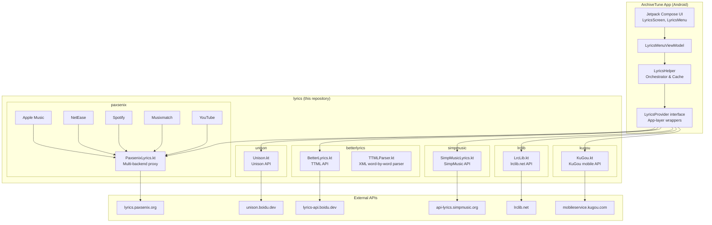

<div align="center">

  <h1>ArchiveTune Lyrics</h1>

  <p align="center">
    <strong>Multi-provider lyrics fetching library.</strong>
    <br />
    <em>Standalone lyrics modules powering <a href="https://github.com/rukamori/ArchiveTune">ArchiveTune</a> — a high-performance, privacy-focused YouTube Music client for Android.</em>
  </p>

  <p align="center">
    
    
    
    
    
  </p>

  <a href="https://star-history.com/#rukamori/lyrics&rukamori/ArchiveTune&Date">
    <picture>
      <source media="(prefers-color-scheme: dark)" srcset="https://api.star-history.com/svg?repos=rukamori/lyrics,rukamori/ArchiveTune&type=Date&theme=dark" />
      <source media="(prefers-color-scheme: light)" srcset="https://api.star-history.com/svg?repos=rukamori/lyrics,rukamori/ArchiveTune&type=Date" />
      
    </picture>
  </a>

</div>

## Overview

This repository contains the standalone lyrics provider modules extracted from [ArchiveTune](https://github.com/rukamori/ArchiveTune). Each module is a self-contained Ktor-based HTTP client for a different lyrics source, designed as pure JVM libraries with no Android dependencies — the same approach as the [core](https://github.com/rukamori/core) submodule.

## Modules

| Module | Source | Description |
|--------|--------|-------------|
| `kugou` | KuGou Music | Fetches LRC lyrics from KuGou's mobile API (`mobileservice.kugou.com`). Searches by title+artist keyword, matches by duration tolerance, downloads base64-encoded LRC. |
| `lrclib` | LRC Lib | Fetches synced + plain lyrics from `lrclib.net`. Uses Levenshtein distance for similarity matching. |
| `simpmusic` | SimpMusic | Fetches crowd-sourced lyrics from `api-lyrics.simpmusic.org`. Indexed by YouTube video ID. |
| `paxsenix` | Paxsenix | Multi-backend proxy client for `lyrics.paxsenix.org`. Wraps Apple Music, NetEase, Spotify, Musixmatch, and YouTube lyrics endpoints. |
| `betterlyrics` | BetterLyrics | Fetches TTML (Apple Music format) lyrics from `lyrics-api.boidu.dev`. Includes a full XML DOM-based TTML parser with word-by-word timing, CJK support, and transliteration. |
| `unison` | Unison | Fetches lyrics from `unison.boidu.dev`. Supports lookup by video ID or metadata (title, artist, album, duration). |

## Features

- **Six independent providers** — each module is a separate Gradle subproject with no cross-dependencies
- **Pure JVM** — no Android SDK required, testable on any JVM
- **Ktor Client** — built on Ktor with content negotiation and JSON serialization
- **Kotlinx Serialization** — all API responses parsed into typed data classes
- **Multiple lyrics formats** — plain text, LRC (synced), TTML (word-by-word), karaoke-style
- **Duration-aware matching** — providers use Levenshtein distance and duration tolerance for accurate results

## Architecture

The diagram below shows how these lyrics modules integrate into the ArchiveTune app.



**Data flow:**
1. `LyricsHelper` receives a playback request with track metadata
2. It iterates through configured providers in user-defined priority order
3. Each app-layer `LyricsProvider` delegates to its corresponding library module
4. The library module makes an HTTP request via Ktor to the external API
5. Raw JSON responses are deserialized via Kotlinx Serialization
6. Results are cached and returned to the UI

## Package Structure

```
moe.rukamori.archivetune/
├── kugou/                   # kugou module
│   └── KuGou.kt             — KuGou API client
├── lrclib/                  # lrclib module
│   └── LrcLib.kt            — LRC Lib API client
├── simpmusic/               # simpmusic module
│   └── SimpMusicLyrics.kt   — SimpMusic lyrics client
├── paxsenix/                # paxsenix module
│   └── PaxsenixLyrics.kt    — Multi-backend proxy client
├── betterlyrics/            # betterlyrics module
│   ├── BetterLyrics.kt      — BetterLyrics API client
│   └── TTMLParser.kt        — TTML XML parser
└── unison/                  # unison module
    └── Unison.kt            — Unison API client
```

## Dependencies

All modules share a common dependency set:

- **Ktor Client** — HTTP client core, OkHttp/CIO engines, content negotiation, JSON serialization, encoding, logging
- **Kotlinx Serialization** — JSON deserialization of API responses
- **JUnit** — unit testing

## Usage

Each module exposes a singleton object with a `getLyrics()` method. Below are examples for each provider.

### KuGou

```kotlin
val lyrics = KuGou.getLyrics(
    query = "Never Gonna Give You Up",
    artist = "Rick Astley",
    duration = 213,
)
```

### LRC Lib

```kotlin
val lyrics = LrcLib.getLyrics(
    title = "Never Gonna Give You Up",
    artist = "Rick Astley",
    duration = 213,
)
```

### SimpMusic

```kotlin
val lyrics = SimpMusicLyrics.getLyrics(
    videoId = "dQw4w9WgXcQ",
    duration = 213,
)
```

### Paxsenix

```kotlin
// Auto-select (chains Apple Music -> NetEase -> Spotify -> Musixmatch)
val lyrics = PaxsenixLyrics.getLyrics(
    title = "Never Gonna Give You Up",
    artist = "Rick Astley",
    duration = 213,
)

// Specific backend
val appleMusic = PaxsenixLyrics.getAppleMusicLyrics(title, artist, duration)
val netease    = PaxsenixLyrics.getNeteaseLyrics(title, artist, duration)
val spotify    = PaxsenixLyrics.getSpotifyLyrics(title, artist, duration)
val musixmatch = PaxsenixLyrics.getMusixmatchLyrics(title, artist, duration)
val youtube    = PaxsenixLyrics.getYouTubeLyrics(title, artist, duration)
```

### BetterLyrics

```kotlin
val lyrics = BetterLyrics.getLyrics(
    title = "Never Gonna Give You Up",
    artist = "Rick Astley",
    album = "Whenever You Need Somebody",
    duration = 213,
)
```

### Unison

```kotlin
val lyrics = Unison.getLyrics(
    videoId = "dQw4w9WgXcQ",
    title = "Never Gonna Give You Up",
    artist = "Rick Astley",
    album = "Whenever You Need Somebody",
    durationSeconds = 213,
)
```

## License

[GNU General Public License v3.0](LICENSE)
